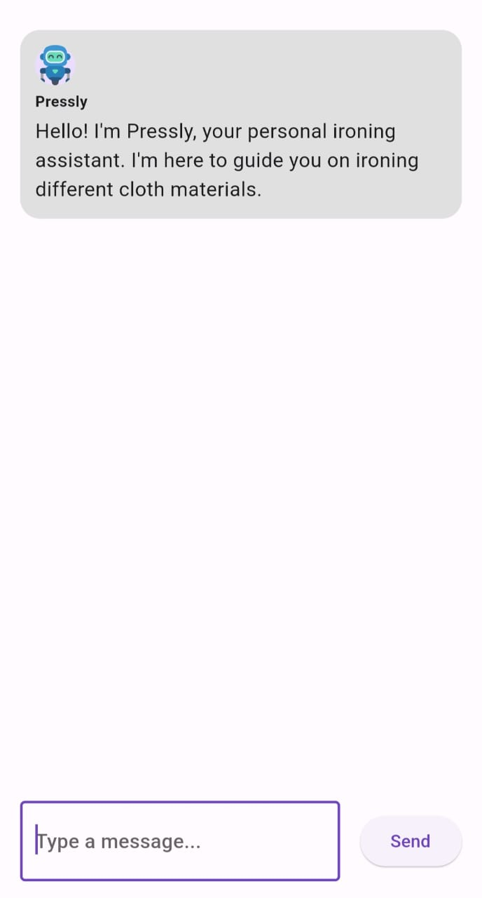
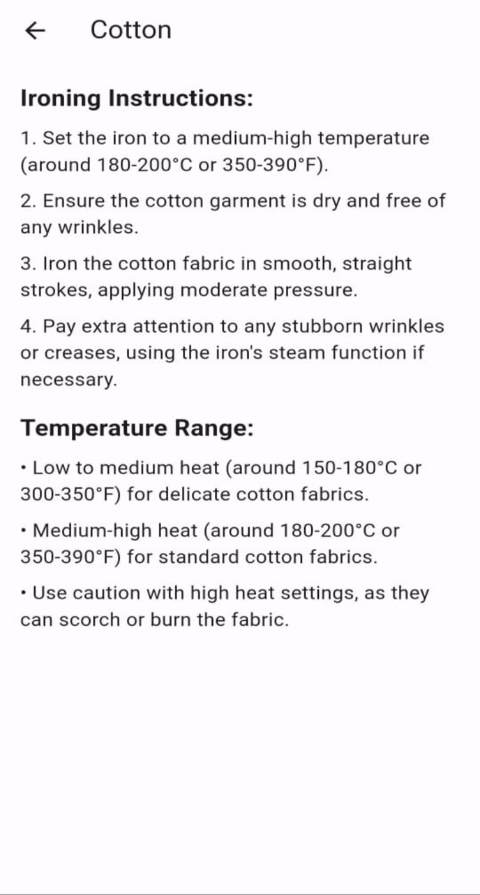

# IronIQ - Clothing Material Ironing Guide App

IronIQ is a mobile application that provides users with a convenient way to iron their clothes by offering temperature recommendations and ironing instructions based on the type of clothing material. With this app, users can ensure that they are using the correct ironing temperature for different fabrics, helping to prevent damage to their clothes.

## Key Features

- Selection of clothing material icons for easy identification
- Temperature recommendations for different materials
- User input for customization and specific fabric blends
- Tutorial and educational content on ironing techniques and fabric care

## Project Status

This app is currently in the early stages of development. The basic user interface and core features have been implemented, and I plan to continually enhance and expand the app based on user feedback and requirements.

## Future Development

In future updates, I plan to include additional features such as:

- Temperature conversion between Celsius and Fahrenheit
- Enhanced user interface and design improvements
- Integration with external fabric care resources
- Database expansion with a wider range of clothing materials

## Screenshots

## Download

You can download the latest version of IronIQ from the following link: [Download IronIQ](https://www.mediafire.com/file/uyshre1mcjwsvki/IronIQ.apk/file)

## Feedback and Contributions

Any feedback, suggestions, or contributions are welcome to help improve this app. If you have any ideas or would like to contribute to the project, please feel free to reach out to me at my email address: abdelrahmankest1868@gmail.com.